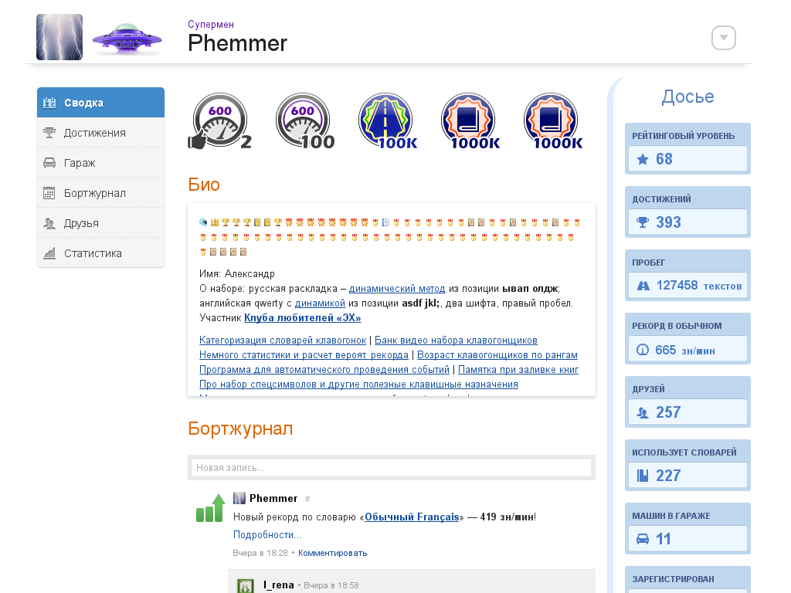
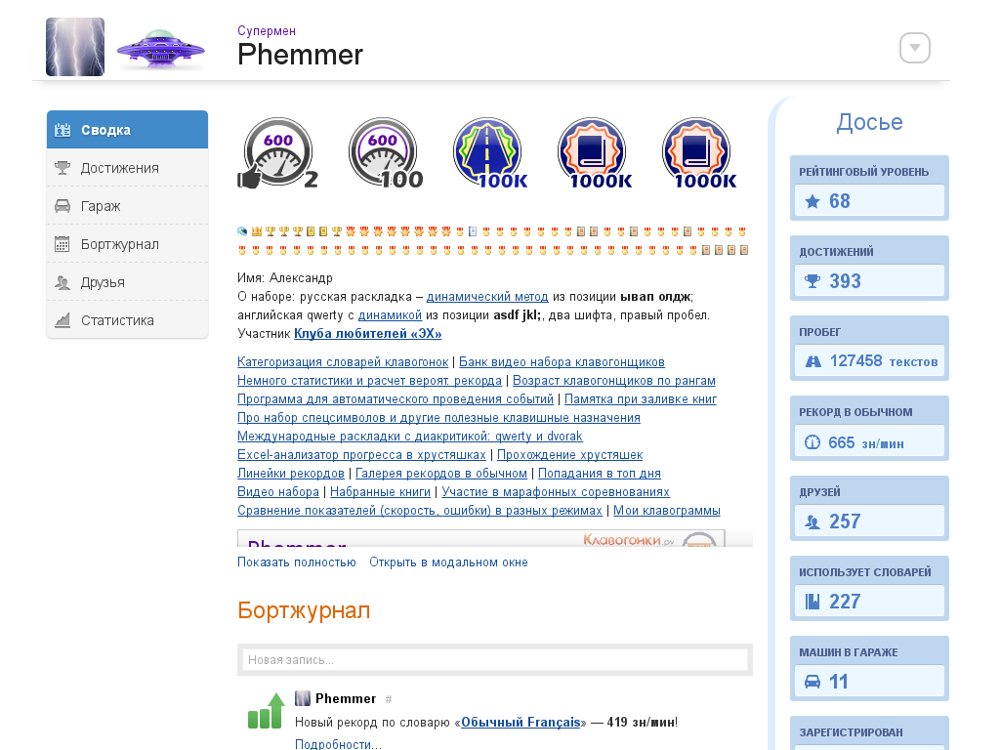

## KG_GlasslessBio 
**Авторы:** [agile](http://klavogonki.ru/u/#/226580/)

Скрипт конфликтует с [KG_ClearProfile](KG_ClearProfile.md).

В разделе «Сводка» изменяет вид блока «Био».

**До:**

**После:**

Большое спасибо [Phemmer](http://klavogonki.ru/u/#/231371/) за идею и помощь в тестировании скрипта!
