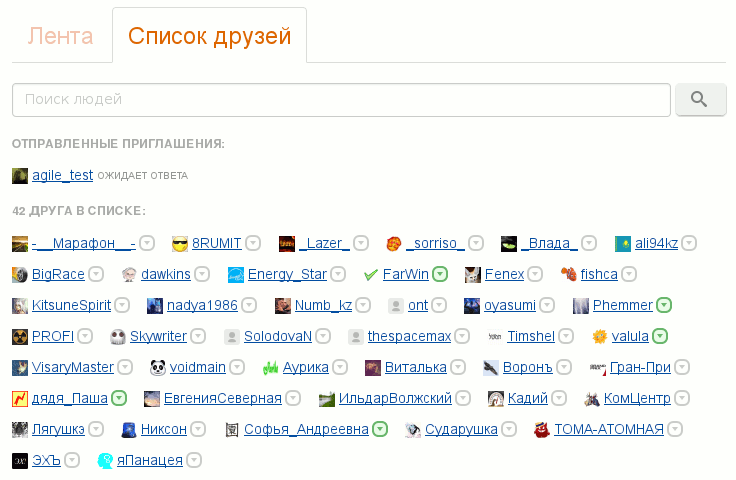

## KG_InlineFriendsList 
**Авторы:** [agile](http://klavogonki.ru/u/#/226580/)

Изменяет вид списка друзей, делая последний более компактным.

Большое спасибо [Phemmer](http://klavogonki.ru/u/#/231371/) за помощь в тестировании скрипта и полезные советы по его улучшению!
