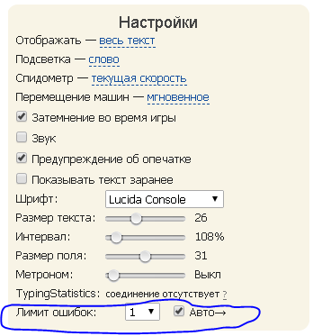

## StopErrorsRace

**Авторы:** [Akmat](http://klavogonki.ru/u/#/503791/)

Останавливает заезд если количество ошибок больше чем указанное в панели настроек. И если поставить галочку на авто то при следующем заезде автоматический создается новый заезд.

Добавляет в заезде на панели настроек выпадающий список "Лимит ошибок" и "Чекбокс Авто"
Можно выключить эту функциональность выбрав ```off``` и при этом чекбокс авто тоже выключится.



В иксах автопереходы отключены и выпадающий список не появляется, даже если выбрали количество ошибок и поставили галочку на авто.