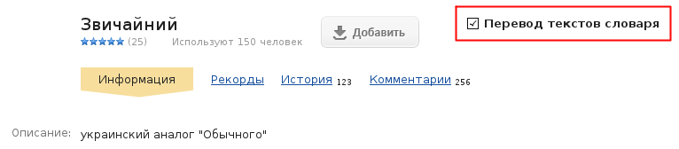

## KG_YandexTranslator 
**Авторы:** [agile](http://klavogonki.ru/u/#/226580/)

Выводит перевод иностранных текстов в заездах при помощи сервиса «Яндекс.Перевод».

По умолчанию скрипт выводит результаты машинного перевода только для текстов, содержащих латинские символы. Включить перевод текстов для определенного словаря можно на его странице:

Список поддерживаемых сервисом языков можно посмотреть [здесь](https://tech.yandex.ru/translate/doc/dg/concepts/langs-docpage/).

Большое спасибо [Бричер](http://klavogonki.ru/u/#/307440/) и [Phemmer](http://klavogonki.ru/u/#/231371/) за помощь в тестировании скрипта и полезные советы по его улучшению!
